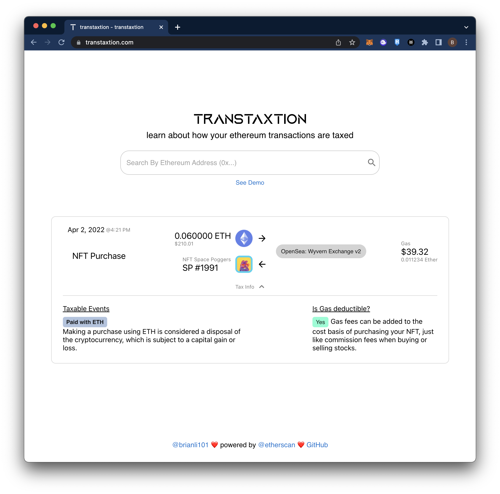

# transtaxtion

transtaxtion provides human-readable explanations for what is taxable on your crypto transactions. Try it out [here](https://transtaxtion.com/)!

At the moment, it only covers the most basic cases for newer adopters of crypto:

| Transaction Type | Covered |
| ---------------- | ------- |
| Receive ETH      | &check; |
| Send ETH         | &check; |
| Buy an NFT       | &check; |
| Sell an NFT      | &check; |
| NFT Mints        |         |
| DeFi Apps        |         |
| L2s              |         |
| ERC20 Tokens     |         |

## Limitations

transtaxtion is not designed to be a crypto tax calculator software, but instead is meant to help users understand what transactions from their wallets are taxable and why. In the case of wallets with simple transactions, it can help users do reasonable calculations.

For anyone with wallets that are engaging with DeFi or complex smart contracts, I recommend using a dedicated software such as [Koinly](https://koinly.io/) or [ZenLedger](https://www.zenledger.io/).

## TODO List

- [ ] Implement actual ETH pricing instead of static constant
- [ ] Fix issue with inbound transactions showing gas fees
- [ ] Improve horizontal sizing of transactions

## Resources

### Etherscan

- https://docs.ethhub.io/guides/deciphering-a-transaction-on-etherscan/

### Crypto Taxes

#### General Guides

- https://koinly.io/cryptocurrency-taxes/

#### NFTs

- https://taxbit.com/blog/nft-tax-guide-what-creators-and-investors-need-to-know-about-nft-taxes

#### Deducting Gas Fees

- https://cryptotrader.tax/blog/ethereum-gas-fees
- https://tokentax.co/blog/are-ethereum-gas-fees-tax-deductible
